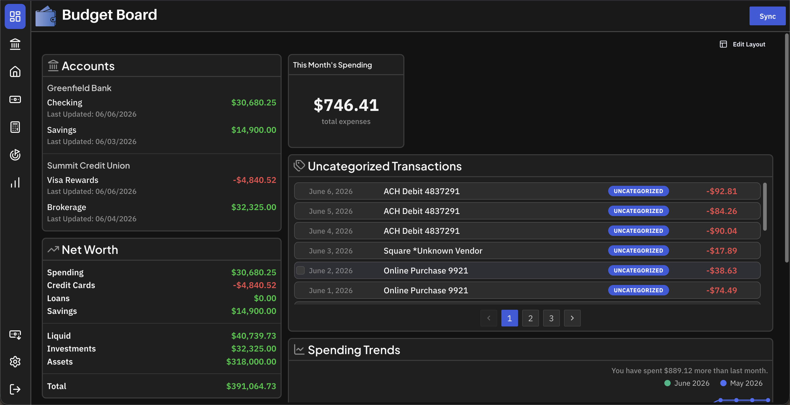
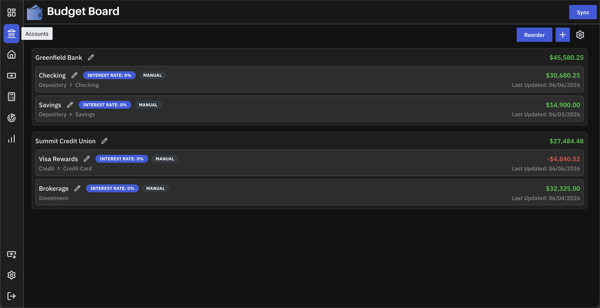
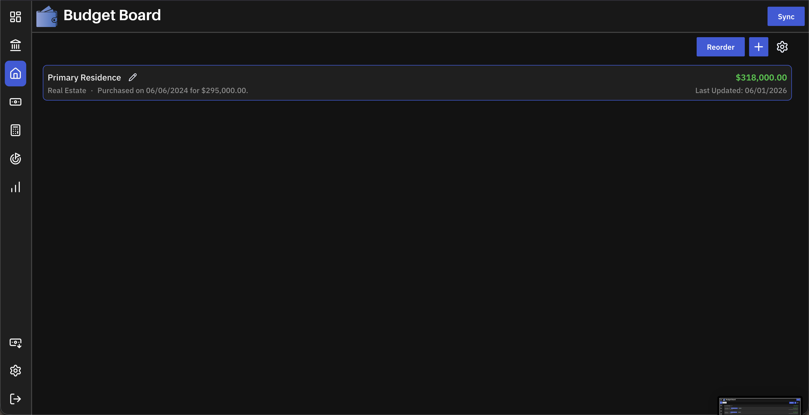
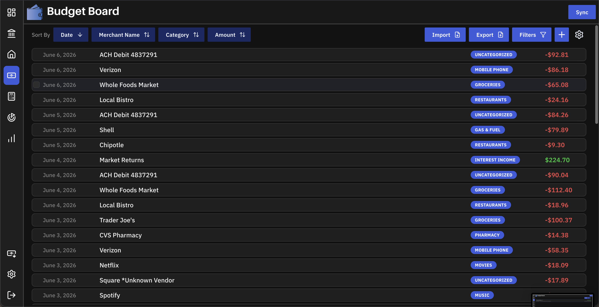
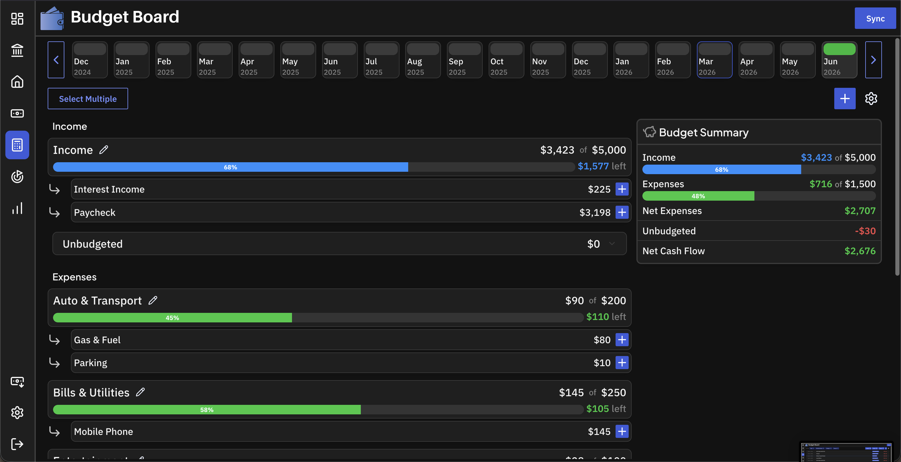
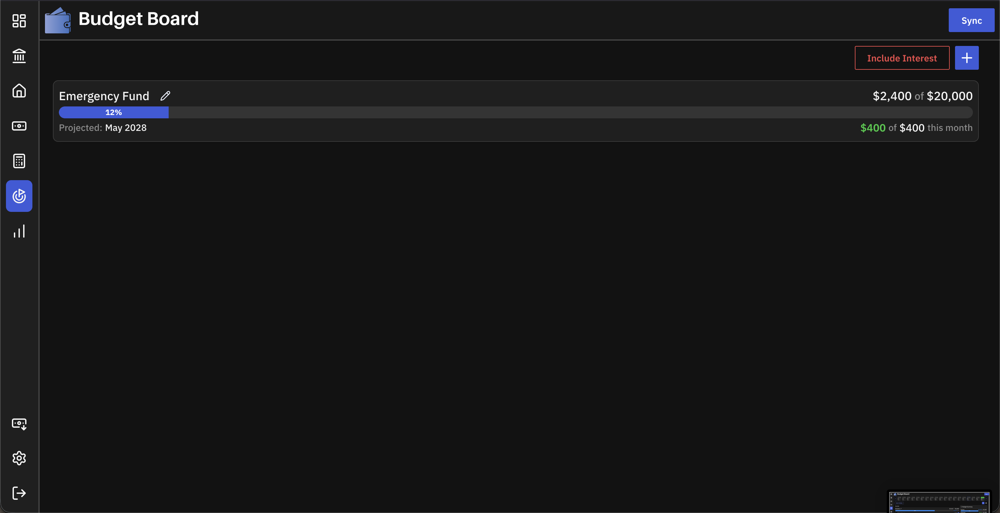
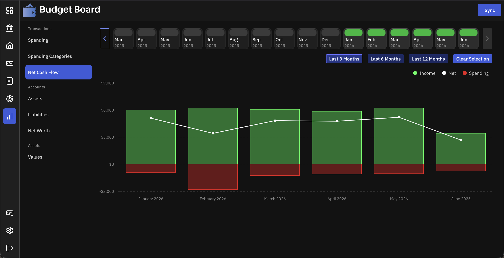
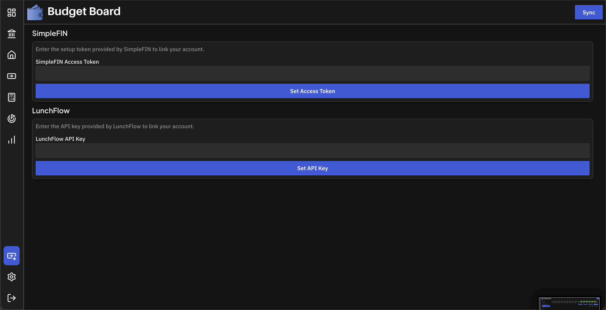

  

---

A simple app for tracking monthly spending and working towards financial goals.

## Getting Started

Check out the [wiki](https://budgetboard.net/) for instructions on how to setup Budget Board.

## About The Project

I created this app to be a self-hosted alternative to the now-shut-down personal finance app Mint.

### Features

#### Manage Finances

- **Accounts & Assets**: Manage both your financial accounts (checking, savings, credit cards) and assets (property, valuables) in one place.
- **Transactions**: Record and categorize your transactions to keep track of your spending habits.
- **Budgeting**: Set monthly budgets for different categories and track your spending against them.

#### Data Import & Automation

- **Transaction CSV Import**: Import transactions in bulk using CSV files.
- **Sync Providers**: Integrate with financial institutions through providers like SimpleFIN and LunchFlow for automatic transaction and account balance syncing.
- **Auto-Categorization**: Train a machine learning model on your categorized transactions to automatically predict categories for new transactions.
- **Automatic Rules**: Create rules to automatically update transactions based on criteria like description, amount, or date.

#### Analytics & Insights

- **Financial Goals**: Set and track progress towards financial goals such as saving for a house or paying off debt.
- **Customizable Trends Charts**: Visualize spending trends with customizable charts that can be filtered by date range, account, and category.

#### Security

- **User Authentication**: Authenticate locally with two-factor authentication (2FA), or bring your own authentication provider with OIDC login.

#### Internationalization

- **Multiple Languages**: Selectable languages include English, German, French, and Simplified Chinese, with community-contributed translations.
- **Localized Date & Number Formats**: Dates and numbers are displayed according to the selected language and locale.

### Feedback

- [Notice a bug?](https://github.com/teelur/budget-board/issues/new/choose)
- [Have a feature request?](https://github.com/teelur/budget-board/discussions/categories/feature-requests)
- [Have any feedback?](https://github.com/teelur/budget-board/discussions/categories/feedback)
- [Have a question?](https://github.com/teelur/budget-board/discussions/categories/q-a)

### Translations

- Help translate Budget Board into other languages at [Weblate](https://hosted.weblate.org/projects/budget-board/).

### Screenshots

