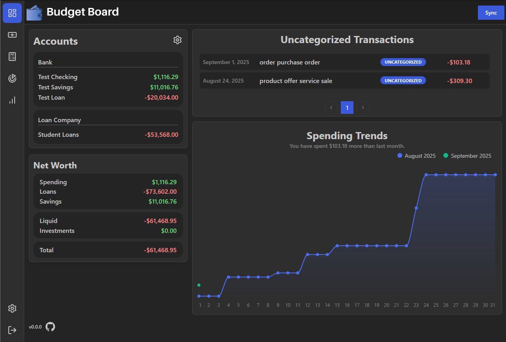
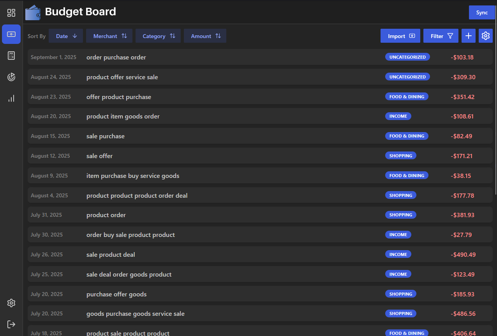
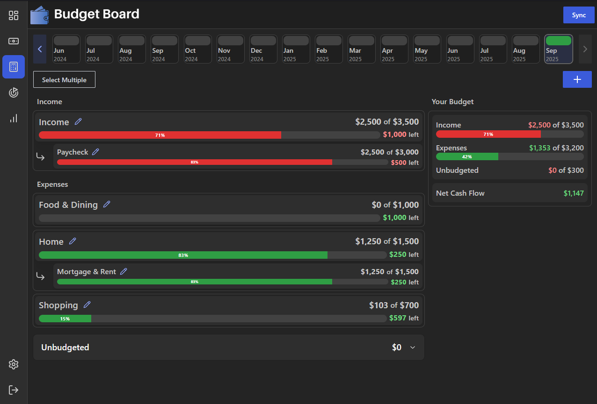
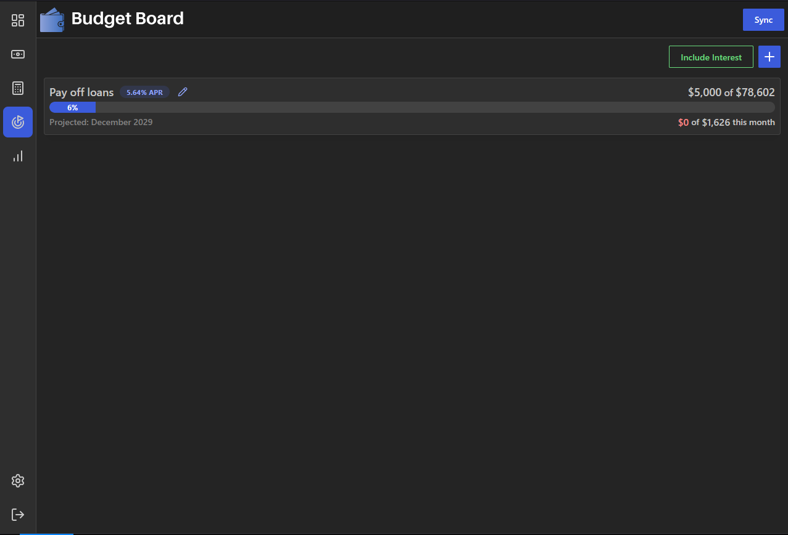
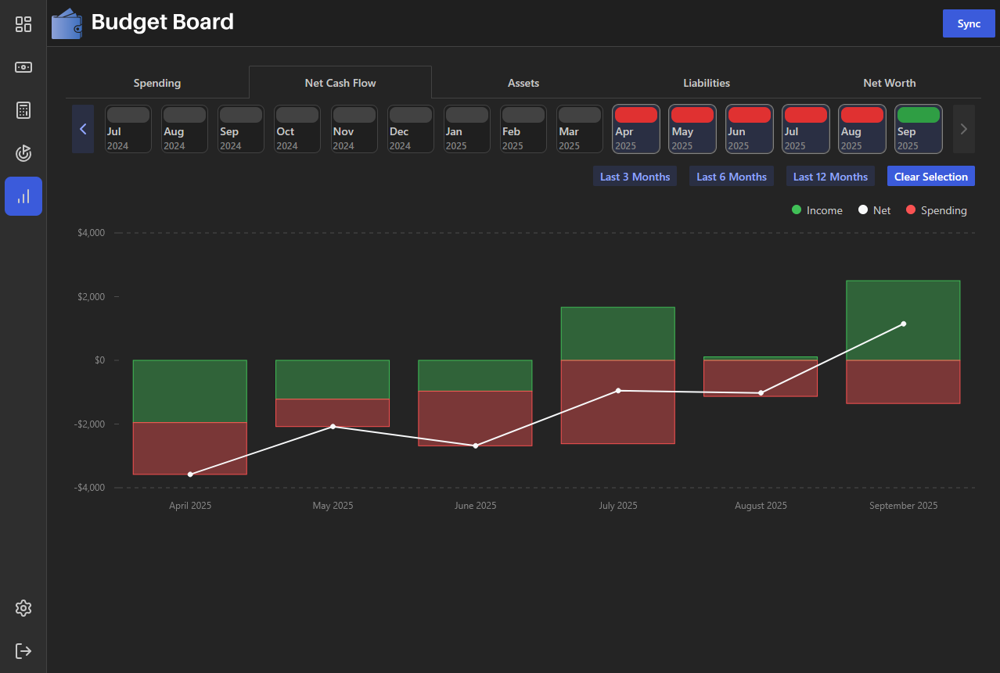

<div align="center" width="100%">
  
</div>

---

[](https://github.com/teelur/budget-board/actions/workflows/docker-image-ci-build.yml)


A simple app for tracking monthly spending and working towards financial goals.

## About The Project

I created this app to be a self-hosted alternative to the now-shut-down personal finance app Mint.

### Features

#### Data Aggregation

- Automatically sync your bank account data (accounts, transactions, balances) with [SimpleFIN](https://www.simplefin.org/).
- Import transactions via CSV files.
- Manually add accounts and transactions.

#### Dashboard View

- Dashboard to view account data at a glance

#### Transactions View

- Organize transactions into categories and subcategories.
- Create custom categories to organize your transactions.
- Create rules that automatically update transaction fields during sync when the specified conditions are met.

#### Budgets View

- Create monthly budgets for categories and subcategories.
- View aggregated budgets for multiple months.
- Calculate net cash flow for the month.
- Click on a budget to view more details such as monthly trends and associated transactions.

#### Goals View

- Create goals to track savings or loan payoff.
- Estimate completion date given a monthly contribution.
- Estimate monthly contibution given a target completion date.
- Option to include interest rate in the calculations.
- Click on a budget to view more details such as monthly trends and associated accounts.

#### Trends View

- Several charts to view different metrics over time.
- View monthly spending trends, monthly net cash flow, total assets, total liabilities, and total net worth charts.

### Feedback

- [Notice a bug?](https://github.com/teelur/budget-board/issues/new/choose)
- [Have a feature request?](https://github.com/teelur/budget-board/discussions/categories/feature-requests)
- [Have any feedback?](https://github.com/teelur/budget-board/discussions/categories/feedback)
- [Have a question?](https://github.com/teelur/budget-board/discussions/categories/q-a)

### Screenshots







## Configuration

### Setting up Docker Compose

This project is deployed using Docker Compose.

The `compose.yml` and `compose.override.yml` files are used to deploy the app.
Both files are able to deploy the app as is, but it is recommended to at least update the database password.

See the [wiki](https://github.com/teelur/budget-board/wiki/Deploying-via-Docker-Compose) for more details about configuring the compose override file.

### Deploy

Deploy the app by running the following command:

```
docker compose up -d
```

You can now access the app at `localhost:6253`.

Check out the [wiki](https://github.com/teelur/budget-board/wiki) for more details about configuration and using the app :)
